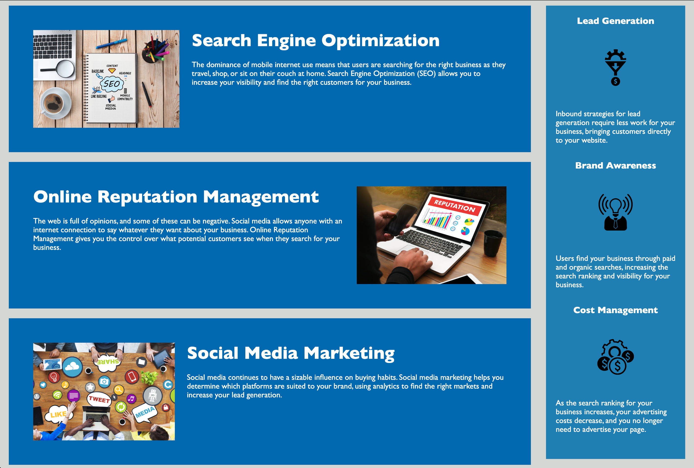

# Code Refactor Starter Code

# Horiseon Online Marketing Agency Webpage

## Description

- I revised the code to adhere to accessibility standards by which I enhanced the website's accessibility for a broader range of users.
- The purpose was to enable individuals with disabilites to navigate the site effectively using assistive techcnologies.
- Meeting these accessibility standards not only improves the chances of the website appearing in search engine results but also helps companies mitigate the risk of potential lawsuits arising from accessibility issues.
- During this process, I gained knowledge on maintaining the functionality of links while refactoring the code and optimizing the CSS file by appropriately assigning CSS selectors and properties, aligning them with the semantic structure of HTML elements.

## Installation

N/A

## Usage

- This website offers users the opportunity to explore the services provided by Horiseon, an online marketing agency, that can enhance clients' businesses through marketing efforts.
- These services encompass search engine optimization, online reputation management, and social media marketing.
- By clicking on the navigation bar located at the top right corner, users are directed to detailed descriptions of these services. Additionally, the sidebar presents additional marketing strategies like lead generation, brand awareness, and cost management.
- In summary, the website serves as a valuable resource for users to gain insights into crucial marketing strategies and the services offered by Horiseon.

## Screenshot of the website

## Credits

N/A

## License

Please refer to the LICENSE in the repo.